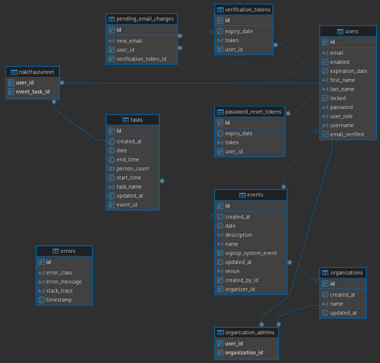

# Development instructions

## Used technologies

- Java 21
- Springboot 3.4.x
    - Incl. data-jpa (Hibernate), security, session
- Thymeleaf templates
- Gradle
- Postgres 17
- JUnit 5 & Mockito
- Project lombok
- Quartz scheduler
- Apache Commons CSV
- Caffeine cache
- Spotless for code formatting
- Git LFS extensions

## General

- Expects Postgres at `localhost:5432`.
    - Hostname be configured by setting `DB_HOST` environment variable.
- Server will be at `localhost:8080`.

To run the service:

    $ ./gradlew bootRunDev

## Setting up

1. Install Git and [Git LFS extensions](https://github.com/git-lfs/git-lfs)
2. Install OpenJDK21
    1. [Windows](https://adoptium.net/temurin/releases/?os=windows&version=21).
    2. Linux: Install from your distro's repo.
    3. [macOs](https://adoptium.net/temurin/releases/?os=mac&version=21).
3. Install podman or docker.
    1. Run Postgres in a container:
       `podman run -dt --pod new:postgres17 -e POSTGRES_PASSWORD=1234 -p 5432:5432 postgres:17.0` or
       `docker run -d -p 5432:5432 --name postgres17 postgres:17.0`
4. Clone the repo
5. Import existing sources as a new project in your favorite IDE (e.g. IntelliJ IDEA).
6. Import Gradle project.

### Adding an initial admin user

By default, when running in `dev` profile an admin user is created.
See [application-dev.properties](../src/main/resources/application-dev.properties) file for default values, and env
variable to set the values with.

## Development guidelines

- All texts that are visible to the end user (e.g. templates, email) must use i18n translations (messages*.properties
  files).
- Main development happens in `develop` branch.
    - All features and bug fixes are done in their own branches (branched off from `develop`).
    - All Pull Requests must squash commits before merge so git history of `develop` (and ultimately `master`) remains
      clean and linear.
    - Delete the source branch once PR is merged.
    - NEVER force-push to `develop`. This will break everyone else's work.
- Directly commiting to `develop` and `master` is blocked on repo level. Only PRs will run CI pipelines.
- Only when a new version is to be released is `develop` merged into `master`.
    - NEVER squash commits when merging `develop` into `master`.
- Use [Semantic versioning](https://en.wikipedia.org/wiki/Software_versioning#Semantic_versioning) for releases.
    - Use Git tags (created in `master`) for releases (builds containers) and the GitHub releases functionality.
- Use GitHub Issues for all features, bugs etc.
- Public interfaces need to have unit tests, and integration tests where appropriate.
- Use Project Lombok annotations for constructors, getters, setters etc.
- Always use Lazy loading on dependent entities.
- Use `@NamedEntityGraphs` and `@EntityGraphs` for database queries to avoid n+1 problems.

## Code quality

- All code, comments, documentation, names of classes and variables, log messages, etc. must be in English.
- The maximum recommended line length is 120 characters.
- Indentation must be made with four spaces, not tabs.
    - Continuation indent is 4.
- Line feeds must be UNIX-like (\n).
- All source files should be UTF-8, except .properties files which should be ISO-8859-1.
- Spotless is used to automatically format code (using [palantirJavaFormat](https://github.com/palantir/palantir-java-format)).
    - CI pipeline will fail if not properly formated.
- All your code should follow the Java Code Conventions regarding variable/method/class naming.
- Be [DRY](https://en.wikipedia.org/wiki/Don%27t_repeat_yourself).
- Try to use [test-driven-development](https://en.wikipedia.org/wiki/Test-driven_development).

Automatically format code with Spotless:

    $ ./gradlew spotlessApply

## Robots.txt

[Robots.txt](../src/main/resources/robots.txt) is configured to only allow search engine bots to index the front page.
It's also configured to block all other bots. The file is read on runtime when needed.
This file should be updated if bot traffic on the service gets too much.

## Database
The current schema is:

Besides the tables visible here, Quartz creates its own tables.

### Database migrations

Hibernate is used to maintain the database schema and is able to update the database schema by itself.

## Spring Boot specifics
### Configuration
Application configuration is defined in `application.properties` and `application-<env>.properties` files. 
On startup Spring Boot will first read `application.properties` file then `application-<env>.properties` file so an environment-specific properties file can be used to override configurations.
All configuration by default goes to `application.properties` file.
Production configuration that needs to override configuration to `application-prod.properties `. 
This includes _all_ secrets and everything else that need easy configuration in production. Values are then read from environment variables. Default values may be used.
